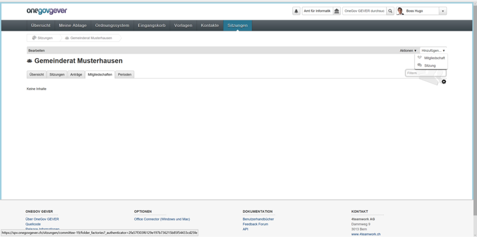
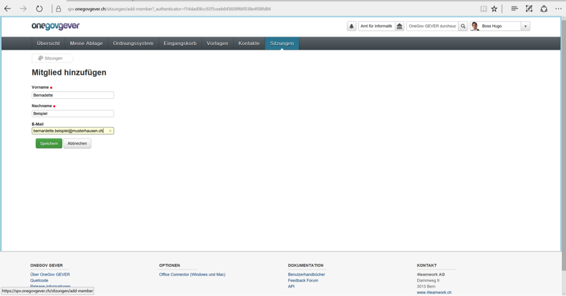
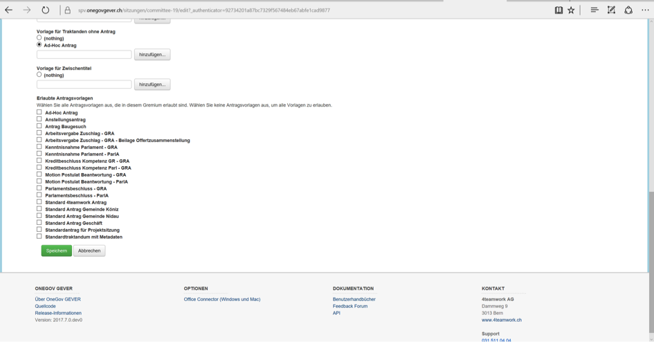
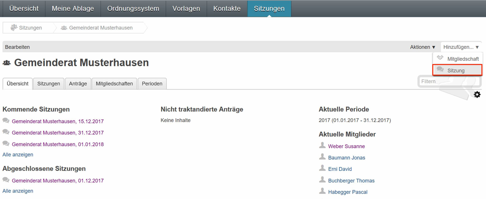
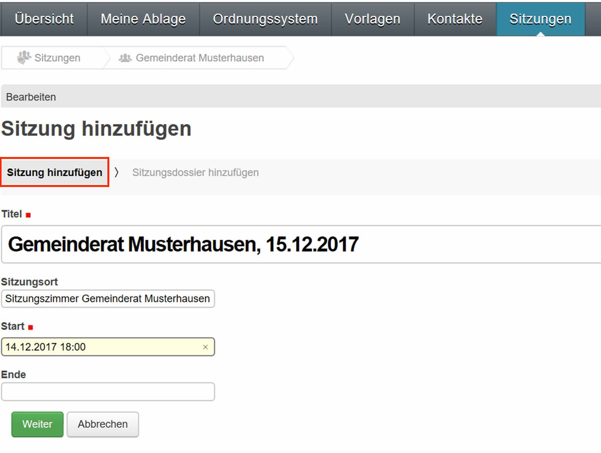

Kommission / Gremium mit seinen Mitgliedern und Sitzungen
---------------------------------------------------------

Kommission / Gremium erfassen
~~~~~~~~~~~~~~~~~~~~~~~~~~~~~

Eine neue Kommission kann im Bereich *Sitzungen* erstellt werden.

1. Pro Kommission muss eine eigene Berechtigungsgruppe festgelegt werden, die
   diese Kommission verwaltet und einsehen kann.

2. Zusätzlich muss auch eine Ablageposition im Ordnungssystem definiert werden.
   Dort wird dann automatisch ein neues Sitzungsdossier erstellt, in welches
   alle Sitzungsunterlagen und -protokolle abgelegt werden.

3. Je nach Berechtigungsvergabe dürfen nur ausgewählte Benutzer die Mitglieder und die dazugehörigen Vorlagen hinzufügen und bearbeiten.

|img-spvupdate-1|

Mitglieder erfassen und Gremium zuweisen
~~~~~~~~~~~~~~~~~~~~~~~~~~~~~~~~~~~~~~~~~

Unter *Sitzungen*, Reiter Mitglieder können entsprechend berechtigte
Mitarbeitende neue Mitglieder hinzufügen. Beachten Sie bitte, dass diese
Mitglieder keine direkte Verlinkung zu den Kontakten in OneGov GEVER aufweisen.

|img-spvupdate-2|

Wenn alle notwendigen Mitglieder erfasst sind, wechseln Sie innerhalb des
Bereichs Sitzungen in das Gremium und weisen dem betroffenen Gremium die soeben
erfassten Gremiumsmitglieder zu (Mitgliedschaft hinzufügen). Vergeben Sie den
ständigen Mitgliedern die entsprechenden Rollen. Legen Sie dazu die
entsprechende Amtszeit/Amtsdauer fest. Die für die Protokollführung
zuständigen Personen werden ebenfalls hier erfasst.

|img-spvupdate-3|
|img-spvupdate-4|

Die Darstellung, die Erfassung und die Bewirtschaftung der Gremiumsmitglieder
ist Gegenstand weiterer Entwicklungen zur SPV.

|img-spvupdate-5|

Entsprechend berechtigte Mitarbeitende können unter
«Bearbeiten / Gremium bearbeiten» die Vorlagen verwalten und pro Gremium die
notwendigen Vorlagen sichtbar machen.

|img-spvupdate-6|

Wenn Sie alle Mitglieder aufgenommen haben, können Sie nun die Sitzungen
erfassen. Das Sitzungsdossier wird der definierten Rubrik im Ordnungssystem
automatisch zugewiesen.

|img-spvupdate-7|

Sitzung erstellen
~~~~~~~~~~~~~~~~~
Um eine neue Sitzung zu erstellen gehen Sie auf das entsprechende Gremium (in
diesem Fall Musterhausen).

|img-spvupdate-36|

Innerhalb des gewünschten Gremiums können Sie wie gewohnt mittels "Hinzufügen"
und dann "Sitzung" eine neue Sitzung erstellen.

|img-spvupdate-37|

Danach erscheint die Eingabemaske fürs Sitzungsdossier - eingeteilt in zwei
Tabs: Im ersten Tab können Sie Sitzungs-Titel sowie Datum (Start/Ende) eingeben.

|img-spvupdate-38|

Im zweiten Tab können Sie dann die Beschreibung und weitere Metadaten eingeben.

|img-spvupdate-39|

Nach dem Speichervorgang erscheint die Sitzung neu auch in der Sitzungsübersicht.

|img-spvupdate-40|

.. |img-spvupdate-3| image:: ../img/media/img-spvupdate-3.png
.. |img-spvupdate-4| image:: ../img/media/img-spvupdate-4.png

.. |img-spvupdate-6| image:: ../img/media/img-spvupdate-6.png
.. |img-spvupdate-7| image:: ../img/media/img-spvupdate-7.png
.. |img-spvupdate-36| image:: ../img/media/img-spvupdate-36.png

.. |img-spvupdate-39| image:: ../img/media/img-spvupdate-39.png
.. |img-spvupdate-40| image:: ../img/media/img-spvupdate-40.png
