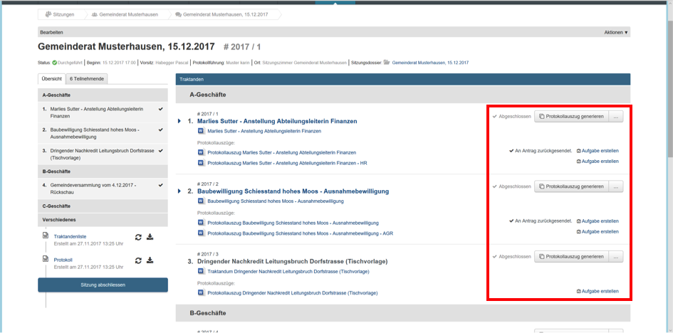
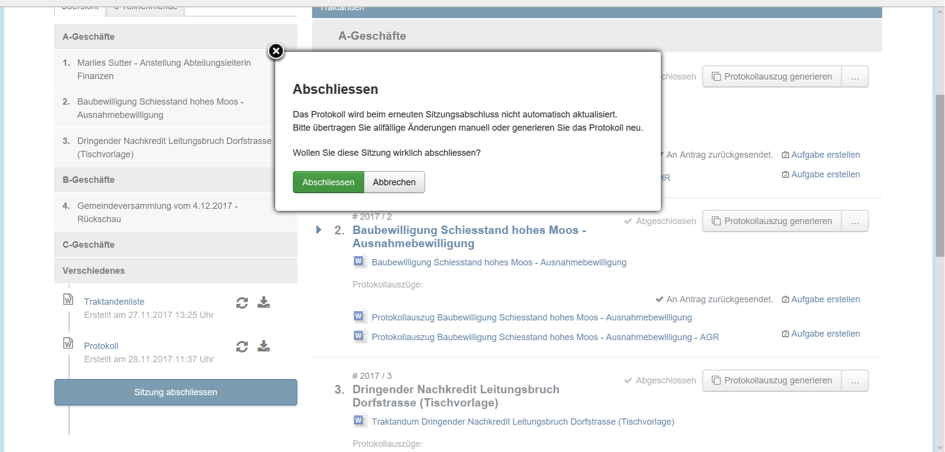
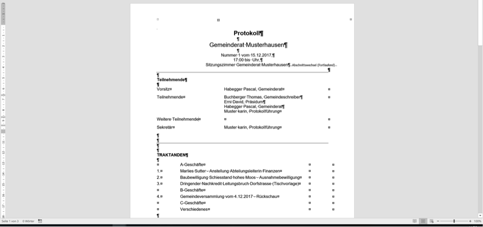
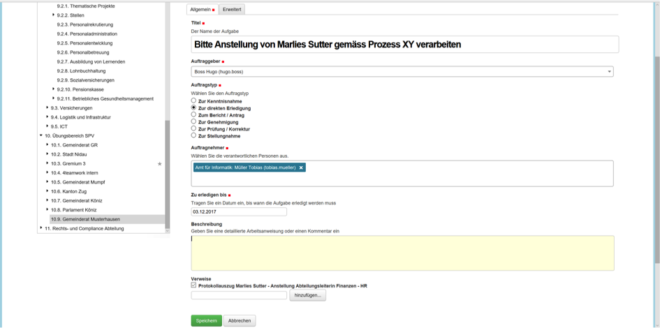

Sitzung abschliessen
--------------------
Sobald alle Traktanden in der gewünschten Form bearbeitet (protokolliert) sind,
kann die Sitzung nachbearbeitet werden.

|img-spvupdate-27|

Sie können nun die Protokollauszüge erstellen. Es ist möglich, mehrere
Protokollauszüge zu generieren. Zur Nachvollziehbarkeit des Geschäftsganges
muss ein Protokollauszug zwingend an den Antragsteller bzw. das Geschäftsdossier
zurückgesendet werden. Weitere Protokollauszüge können sinnvoll sein für externe
Empfänger wie andere Gemeinden, Kantonsverwaltung etc.

|img-spvupdate-34|
|img-spvupdate-35|

Schliessen Sie die Sitzung korrekt ab, indem Sie den Button «Sitzung
abschliessen» anwählen.

|img-spvupdate-28|

Sie können nun das Protokoll fertigstellen. Klicken Sie auf den Protokoll-Titel
und dann wie gewohnt auf Auschecken/Bearbeiten. Das Protokoll hat nach Abschluss
der Sitzung den Platz des Vorprotokolls eingenommen. Bitte beachten Sie, dass
das Protokoll vor Abschluss der Sitzung generiert werden muss. Ist die Sitzung
abgeschlossen, muss diese wieder geöffnet werden, damit das Protokoll neu
generiert werden kann.

|img-spvupdate-29|
|img-spvupdate-30|

Sobald die Traktanden abgeschlossen sind besteht die Möglichkeit, direkt aus der
Sitzung Aufgaben analog GEVER zu erstellen und zu versenden.

|img-spvupdate-31|

.. |img-spvupdate-29| image:: ../img/media/img-spvupdate-29.png

.. |img-spvupdate-34| image:: ../img/media/img-spvupdate-34.png
.. |img-spvupdate-35| image:: ../img/media/img-spvupdate-35.png
