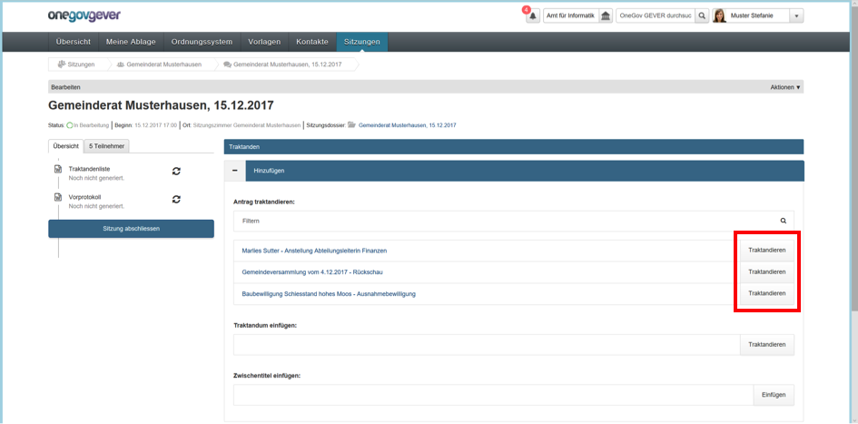
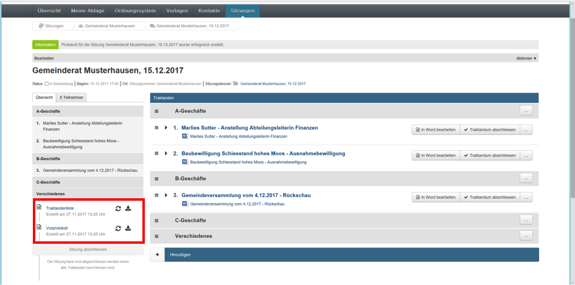
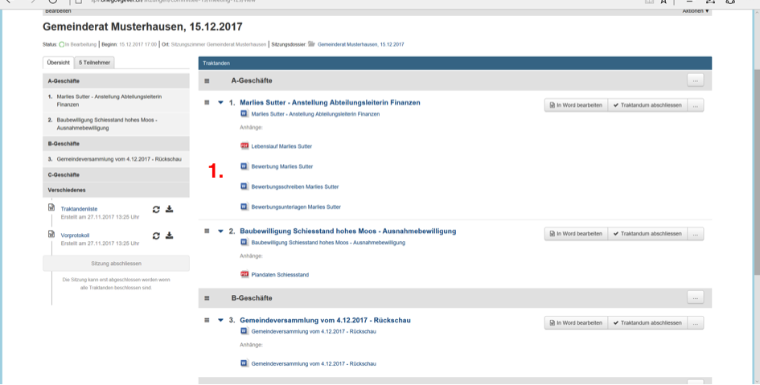

Sitzung vorbereiten
-------------------
Sitzungen können pro Gremium unterschiedlich strukturiert werden. Um dies zu
unterstützen können Zwischentitel eingefügt werden (beispielsweise zur
Einteilung in A-B-C-Geschäfte). Die Zwischentitel können manuell verschoben
werden.

Mit der Aktion «Traktandieren» fügen Sie nun die Anträge der betreffenden
Sitzung hinzu. Die Anträge können innerhalb der Sitzung mit Drag'n'Drop
verschoben werden, die Nummerierung wird automatisch nachgeführt.

|img-spvupdate-20|

Ist die Sitzung vorbereitet, besteht die Möglichkeit die Traktandenliste
und/oder ein Vorprotokoll zu generieren. Sofern erwünscht, können diese
Dokumente den Ratsmitgliedern als ZIP-File zugestellt werden.

|img-spvupdate-21|

Ansicht einer vorbereiteten Sitzung:

|img-spvupdate-22|
|img-spvupdate-23|

1. Die Ansicht der Beilagen pro Antrag lässt sich ein- und ausklappen.
2. Über «Bearbeiten» können weitere Teilnehmende (Gäste) hinzugefügt werden.
3. In diesem Feld kann die Protokollführende Person ausgewählt werden.
4. Der Beginn der Seitennummerierung kann hier festgelegt werden.

.. note::
   Der Beginn der Seitennummerierung pro Protokoll wird manuell hinterlegt. Die Sitzungs- und Protokollverwaltung übernimmt die Seitenzahl nicht automatisiert, da die Protokolle nach der Generierung frei nach den individuellen Kundenbedürfnissen bearbeitet werden können. Bei der Eröffnung bzw. der Bearbeitung der nächsten Sitzung muss also die fortlaufende Seitenzahl (letzte Seite Protokoll der vorhergehenden Sitzung + 1) manuell eingetragen werden.

.. |img-spvupdate-23| image:: ../img/media/img-spvupdate-23.png

.. disqus::
