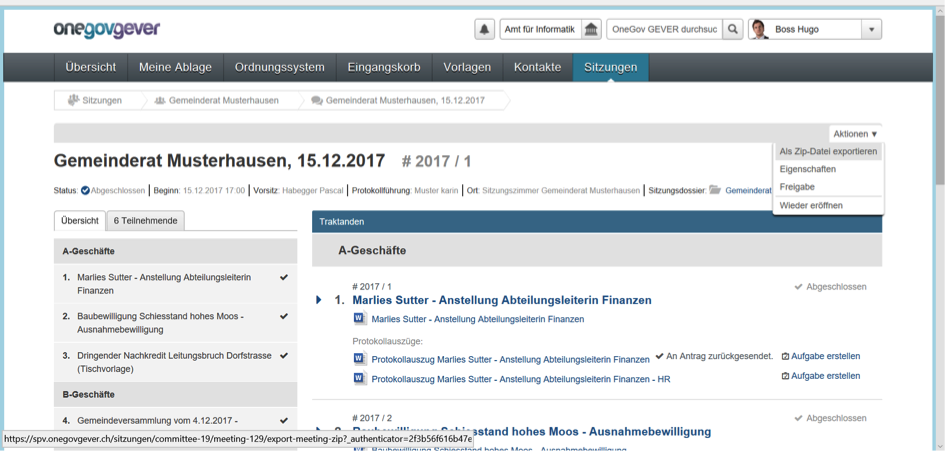

Sitzungsunterlagen aufbereiten
------------------------------
Sie haben jederzeit die Möglichkeit die Inhalte aus der SPV in eine ZIP-Datei
zu exportieren (einzelne Geschäfte inkl. Anhänge). Diese können Sie den
Behördenmitgliedern via Email, Teamraum oder einer anderen
Collaborationplattform zur Verfügung stellen.

|img-spvupdate-32|

Weiter haben Sie die Möglichkeit, ein Zip der Sitzung zu generieren, in welchem
alle Dokumente direkt als PDF eingefügt werden.

|img-spvupdate-43|

.. note::
    Der Pfadname beim ZIP-Download lässt bei Windows maximal 260 Zeichen zu.
    Bitte achten Sie daher beim Sitzungsnamen darauf, dass diese Beschränkung
    nicht überschritten wird. Ab Windows 10 (Version 1607) besteht die
    Möglichkeit, dass ein längerer Pfadname mittels Konfiguration zugelassen
    werden kann. Alternativ kann das  Zip-Programm http://www.7-zip.org/
    installiert werden, welches mit langen Zip-Namen umgehen kann.

.. |img-spvupdate-43| image:: ../img/media/img-spvupdate-43.png

.. disqus::
