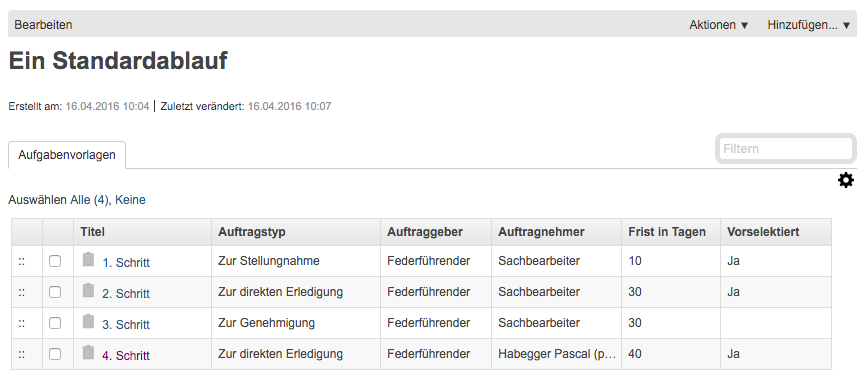

.. _label-standardablauf-benutzer:
.. _kapitel-standardablaeufe:

Mit Standardabläufen arbeiten
=============================

Was ist ein Standardablauf?
---------------------------

Wiederkehrende Aufgabenketten (z.B. vorgegebene Projektschritte) können
in OneGov GEVER unter der Anwendungskomponente Vorlagen hinterlegt
werden. Diese vordefinierten Aufgabenketten bzw. Aufgabenfolgen werden
Standardabläufe genannt.

Die Erstellung und Bearbeitung von Standardabläufen ist Benutzenden, welche für
die Vorlagen-Verwaltung berechtigt sind, vorbehalten. Oft sind dies gleichzeitig
auch die Administratoren. Daher wird die Erstellung von Standardabläufen in der
:ref:`Admin-Dokumentation <label-standardablauf-admin>` behandelt.

|img-standardablauf-1|

Klickt man auf einen Standardablauf unter *Vorlagen*, werden die einzelnen
Aufgaben und deren Details angezeigt:

a) Titel der Aufgabe

b) Auftragstyp

c) Auftraggeber

d) Auftragnehmer

e) Frist in Tagen ab Auslösung der Aufgabe

f) Vorselektion: Angabe, ob die Aufgabe automatisch ausgewählt werden
   soll, wenn man den Standardablauf in einem Dossier auslöst.

|img-standardablauf-2|

Parallele und sequenzielle Abläufe
----------------------------------
Es wird zwischen parallelen und sequenziellen Standardabläufen unterschieden.
Parallel bedeutet in diesem Fall, dass mehrere Aufgaben gleichzeitig ausgelöst
werden. Sequenziell bedeutet, dass alle Aufgaben erstellt, aber nacheinander
ausgelöst werden. Dabei gilt, dass die nächste Aufgabe erst ausgelöst wird, wenn
die Aufgabe davor abgeschlossen wurde. Der Benutzer kann im Dropdown wählen,
welchen Ablauftyp er benutzen möchte.

Der Ablauftyp (sequenziell oder parallel) wird durch den Ersteller des
Standardablaufs definiert und kann bei der Auslösung nicht übersteuert werden.
Auf die Unterschiede der beiden Ablauf-Typen wird weiter unten noch genauer
eingegangen.

Einen Standardablauf auslösen
-----------------------------

Wählen Sie innerhalb eines Dossiers oder Subdossiers
*Hinzufügen → Standardablauf auslösen*.

|img-standardablauf-32|

Wählen Sie den gewünschten Standardablauf aus und klicken Sie
*Weiter*.

|img-standardablauf-33|

Die in der Vorlage mit *Vorselektiert* bezeichneten Aufgaben sind
bereits ausgewählt. Mit der gedrückten :kbd:`Ctrl`-Taste können weitere
Aufgaben hinzu- oder weggeklickt werden.

|img-standardablauf-34|

In einem weiteren Schritt müssen die Auftragnehmer der einzelnen Aufgaben
definiert werden. Enthält die Aufgabenvorlage bereits einen Vorschlag für den
Auftragnehmer, wird dieser selektiert. Dieser kann aber auch übersteuert werden.

|img-standardablauf-35|

Mit *Speichern* werden die ausgewählten Aufgaben ins Dossier übernommen.
Nun stehen die Aufgaben wie gewohnt zur weiteren Bearbeitung bereit (siehe
:ref:`kapitel-aufgaben`). Ab hier werden auch die Unterschiede von einem
parallelen zu sequenziellen Ablauf vorallem beim Status deutlich.

Beim Auslösen eines parallelen Standardablaufs wird eine Hauptaufgabe mit
mehreren Unteraufgaben erstellt. Auf der Hauptaufgabe ist ersichtlich, dass es
sich um einen parallelen Standardablauf handelt. Wird ein paralleler
Standardablauf ausgelöst, so werden alle Aufgaben automatisch in den Status
"Offen" versetzt und stehen somit zur gleichzeitigen Bearbeitung bereit.

Beim Auslösen eines sequenziellen Standardablaufs wird ebenfalls eine
Hauptaufgabe mit mehreren Unteraufgaben erstellt. Auf der Hauptaufgabe ist
ersichtlich, dass es sich um einen sequenziellen Standardablauf handelt. Wird
ein sequenzieller Standardablauf ausgelöst, so wird die erste Aufgabe im Ablauf
automatisch geöffnet, alle weiteren werden im Zustand «Geplant» initialisiert-
Die geplanten Aufgaben sind schon sichtbar, aber werden nicht als pendent
aufgelistet. Wird eine Aufgabe erledigt, so wird die nächste Aufgabe im Ablauf
automatisch geöffnet resp. in den Status "Offen" versetzt und somit sichtbar.

|img-standardablauf-36|

Zu beachten bei sequenziellen Aufgaben
--------------------------------------

-   Wird eine Aufgabe abgelehnt, wird sie dem Auftraggeber zugewiesen. Dieser
    hat die Möglichkeit, die Aufgabe wieder zu öffnen (und dann «Neu zuweisen»,
    «Abschliessen»). Bei sequenziellen Aufgaben besteht zudem die Möglichkeit,
    die Aufgabe zu «überspringen».

|img-standardablauf-38|

-   Auf der Ansicht der Hauptaufgabe eines sequenziellen Standardablaufs kann in
    der Auflistung der Teilaufgaben direkt eine neue Aufgabe eingefügt werden.
    Der Standardablauf kann also individuell ergänzt werden. Das anschliessend
    geöffnete Hinzufügen-Formular der Aufgabe verhält sich wie das :ref:`normale Aufgaben-Formular <label-aufgaben_erstellen>` und fügt sich automatisch in den Standardablauf ein.

|img-standardablauf-37|

.. |img-standardablauf-1| image:: img/media/img-standardablauf-1.png

.. |img-standardablauf-32| image:: img/media/img-standardablauf-32.png
.. |img-standardablauf-33| image:: img/media/img-standardablauf-33.png
.. |img-standardablauf-34| image:: img/media/img-standardablauf-34.png
.. |img-standardablauf-35| image:: img/media/img-standardablauf-35.png
.. |img-standardablauf-36| image:: img/media/img-standardablauf-36.png
.. |img-standardablauf-37| image:: img/media/img-standardablauf-37.png
.. |img-standardablauf-38| image:: img/media/img-standardablauf-38.png

.. disqus::
