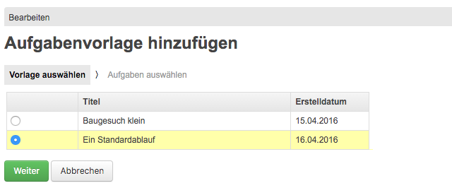
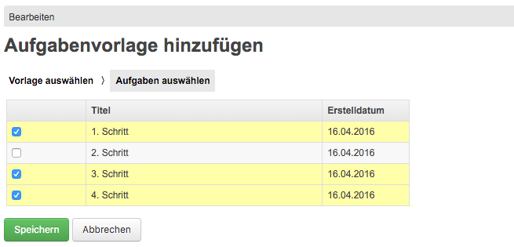
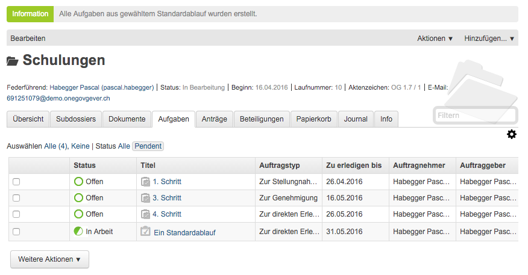
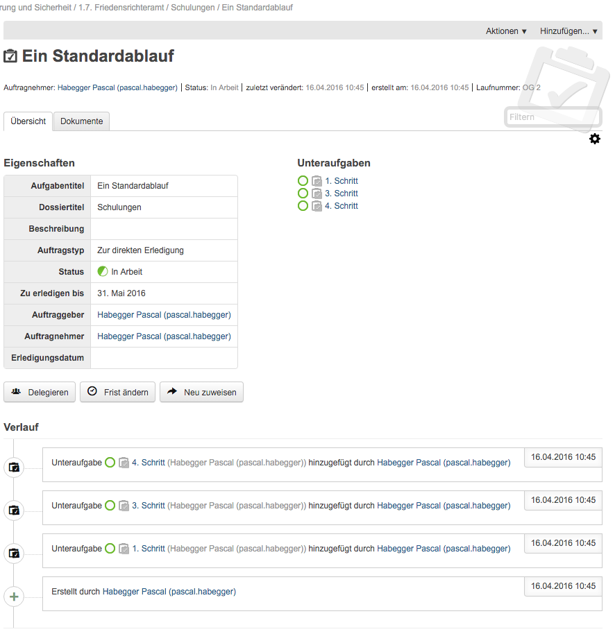

.. _kapitel-standardablaeufe:

Mit Standardabläufen arbeiten
=============================

Was ist ein Standardablauf
--------------------------

Wiederkehrende Aufgabenketten (z.B. vorgegebene Projektschritte) können
in OneGov GEVER unter der Anwendungskomponente Vorlagen hinterlegt
werden. Diese vordefinierten Aufgabenketten bzw. Aufgabenfolgen werden
Standardabläufe genannt. Standardabläufe können normalerweise (je nach
Berechtigungen) durch Personen mit Administrator-Rolle definiert werden.

|img-standardablauf-1|

Klickt man auf einen Standardablauf, werden die einzelnen Aufgaben und
deren Details angezeigt:

a) Titel der Aufgabe

b) Auftragstyp

c) Auftraggeber

d) Auftragnehmer

e) Frist in Tagen ab Auslösung der Aufgabe

f) Vorselektion: Angabe, ob die Aufgabe automatisch ausgewählt werden
   soll, wenn man den Standardablauf in einem Dossier auslöst.

   |img-standardablauf-2|

Ein Standardablauf setzt sich dabei aus *Aufgabenvorlagen* zusammen. Diese
verhalten sich ähnlich wie normale Aufgaben - bei der Eingabe von Auftraggeber
und Auftraggeber steht aber neben den registrierten Benutzern und
Eingangskörben der OneGov GEVER Installation auch ein sogenannter *interaktiver
Benutzer* zur Verfügung.

Wird in der Aufgabenvorlage für den Auftraggeber oder -nehmer der
*interaktive Benutzer* ausgewählt, muss nicht eine konkrete Person ausgewählt
werden, sondern eine *Rolle*. Als Rollen stehen die federführende Person
(*Federführender*) oder der zuständige *Sachbearbeiter* zur Auswahl.
Erst beim Auslösen des Standardablaufs in einem Dossier werden dann die Rollen
automatisch durch konkrete Benutzer ersetzt. Die federführende Person
entspricht dann dem Benutzer, der im entsprechenden Dossier die Federführung
inne hat. Der Sachbearbeiter entspricht dem Benutzer, der den Standardablauf
auslöst.

.. note::
   Interaktive und normale Benutzer können in einer Aufgabenvorlage
   kombiniert werden. Z.B. kann für den Auftraggeber der interaktive
   Benuter *Sachbearbeiter* und für den Auftragnehmer ein konkreter
   Benutzer hinterlegt werden.

Einen Standardablauf auslösen
-----------------------------

Wählen Sie innerhalb eines Dossiers oder Subdossiers
*Hinzufügen → Standardablauf auslösen*.

Wählen Sie den gewünschten Standardablauf aus und klicken Sie
*Weiter*.

|img-standardablauf-3|

Die in der Vorlage mit *Vorselektiert* bezeichneten Aufgaben sind
bereits ausgewählt. Mit der gedrückten :kbd:`Ctrl` können weitere
Aufgaben hinzu- oder weggeklickt werden.

|img-standardablauf-4|

Mit *Speichern* werden die ausgewählten Aufgaben ins Dossier übernommen.
Der Titel des Standardablaufs wird als Hauptaufgabe vom Typ „Zur
direkten Erledigung“ dargestellt und automatisch auf den Status *In
Arbeit* gesetzt. Die Frist der Hauptaufgabe wird aus dem spätesten
Termin der Unteraufgaben plus 5 Tage angegeben. Aus den einzelnen
Aufgabenschritten werden Unteraufgaben erstellt; diese befinden sich im
Status *Offen*.

|img-standardablauf-5|

Bei Bedarf können nun die Eigenschaften der Aufgaben angepasst werden
(Frist, Auftragnehmer etc.). Öffnen Sie dazu die Aufgabe und klicken Sie
auf *Bearbeiten*. Wird die Frist der Unteraufgabe geändert, wird
gegebenenfalls auch die Frist der Hauptgabe automatisch angepasst
(letzte Frist plus 5 Tage).

|img-standardablauf-6|

Anschliessend stehen die Aufgaben zur weiteren Bearbeitung bereit (siehe
:ref:`kapitel-aufgaben`).

.. |img-standardablauf-1| image:: img/media/img-standardablauf-1.png
.. |img-standardablauf-2| image:: img/media/img-standardablauf-2.png

.. disqus::
