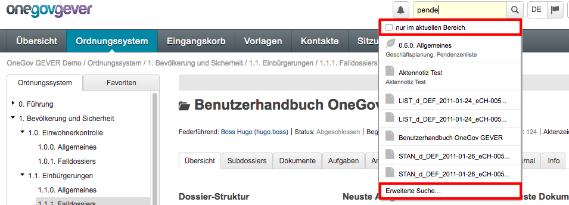
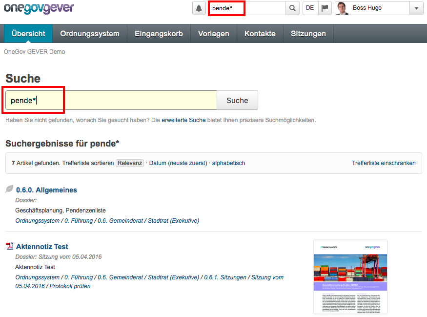
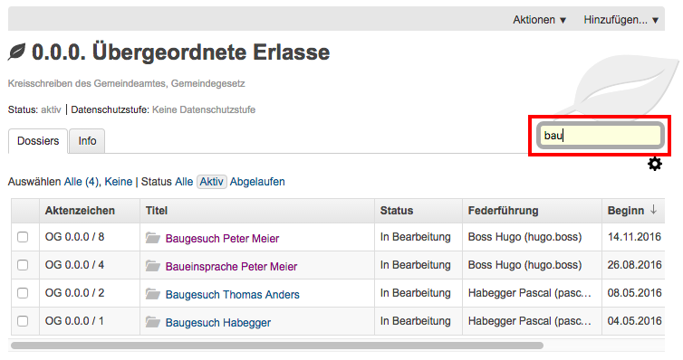
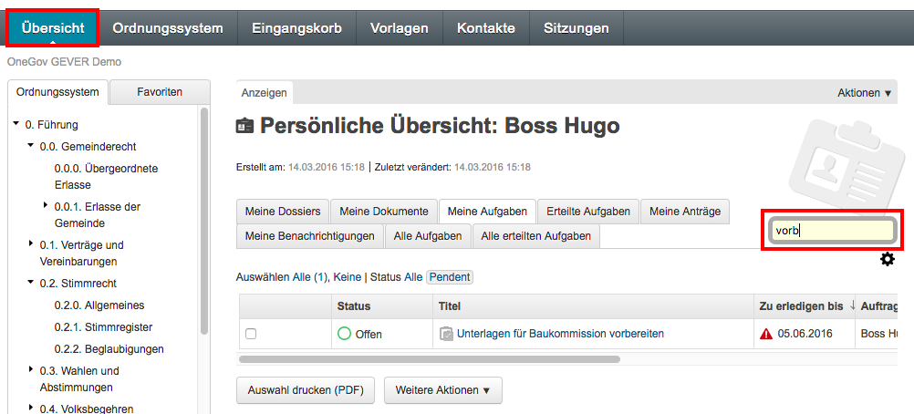
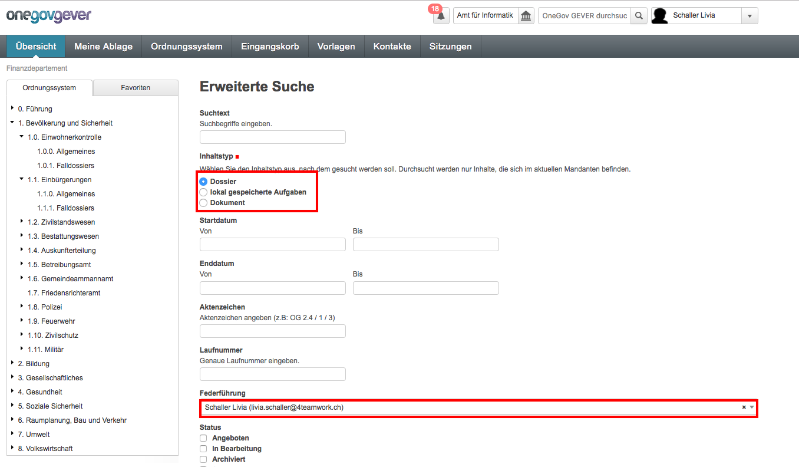

.. _label-suchen:
.. _kapitel-suchen_und_filtern:

Suchen und Filtern
==================

Suchtypen
---------

Es stehen drei Suchtypen zur Verfügung:

-  Einfache Suche (live search)

-  Erweiterte Suche

-  Filtern

Mit der einfachen und der erweiterten Suche werden durchsucht:

-  die Textfelder aller Objekte (Dossiers, Dokumente, Aufgaben)

-  sowie die Datei-Inhalte (Volltextsuche).

Mit der Filtersuche (z.B. innerhalb eines Dossiers) werden Objekte
(Dossiers, Dokumente oder Aufgaben) aus Listen ausgewählt.
Der eingegebene Begriff durchsucht dabei alle Objekte ebenfalls im Volltext
und liefert die Ergebnisse direkt in der Liste.

Regeln für alle drei Suchtypen
~~~~~~~~~~~~~~~~~~~~~~~~~~~~~~

-  Zwischen Gross- und Kleinschreibung wird nicht unterschieden.

-  Die Suchbegriffe werden immer AND-verknüpft, d.h. man kann mehrere
   Suchbegriffe eingeben. Nötig ist nur ein Leerschlag zwischen den
   Suchbegriffen, aber keine spezielles Zeichen. Aufgezeigt werden dann
   die Treffer, die alle Suchbegriffe enthalten.

Einfache Suche
--------------

Zum Suchen mit der einfachen Suche gibt es zwei Vorgehensweisen:

a) Suchen mittels Eingabe von Wortanfängen

b) Suchen mittels Eingabe von exakten Begriffen

Suchen mittels Eingabe von Wortanfängen (Sofortsuche)
~~~~~~~~~~~~~~~~~~~~~~~~~~~~~~~~~~~~~~~~~~~~~~~~~~~~~

Der Suchbegriff kann direkt in das Sucheingabefeld getippt werden. Die
ersten zehn Suchresultate werden “\ *on the fly“* vorgeschlagen, d.h.
sie erscheinen in einer Liste unterhalb des Suchfelds. Schon beim
Einfüllen des Suchbegriffs setzt das System automatisch auf der rechten
Seite eine Trunkierung (``*``). Klickt man auf *Zeige alle*, so erscheint
die vollständige Trefferliste, d.h. alle Begriffe, die mit dem
eingefüllten Wort(teil) beginnen, werden gefunden.

Beispiel: Suche nach dem Wortanfang

|img-suchen-1|

Das System setzt automatisch ein Sternchen (``*``) und findet alle Wörter,
die mit `pende` beginnen. Falls es sich bei den Suchtreffern um Dokumente
handelt, wird auch das zugehörige Vorschaubild angezeigt (bei aktiviertem
Modul "Visuelle Suche")

|img-suchen-2|

Die Darstellung der Suchresultate (Trefferliste) ist standardmässig nach
Relevanz sortiert. Die Resultate können im Suchresultat-Fenster auch
nach "Datum" und "alphabetisch" sortiert werden. Dazu muss nur die
jeweilige Option angeklickt werden.

|img-suchen-3|

Zusätzlich besteht die Möglichkeit, die Trefferliste weiter einzuschränken,
indem die Auswahl an Inhaltstypen oder der Zeitbereich des Erstelldatums
beschränkt wird.

.. note::
   Bei der Eingabe von Wortfragmenten werden nur Wortanfänge berücksichtigt.

   Beispiel: Die Eingabe von ``test`` findet ``Testresultat``, ``Teststrecke``,
   aber nicht ``Lasttest``

Suchen mittels Eingabe von exakten Begriffen
~~~~~~~~~~~~~~~~~~~~~~~~~~~~~~~~~~~~~~~~~~~~

Schreibt man in das Suchfeld der Sofortsuche den exakt gewünschten Begriff,
so muss man anschliessend mit :kbd:`Enter` quittieren oder den Knopf *Suche*
drücken. In diesem Fall werden nur die Treffer aufgelistet, die den
exakten Begriff enthalten. Die Trefferliste ist entsprechend kürzer.

Erweiterte Suche
----------------

Auf die *Erweiterte Suche* gelangt der User entweder über das Suchfeld oben
rechts, indem er auf *Erweiterte Suche* klickt.

|img-suchen-6|

Oder ist der Benutzer bereits auf der Suchresultat-Seite, kann er auch von da
auf die *Erweiterte Suche* wechseln:

|img-suchen-7|

Auf der Maske der *Erweiterten Suche* werden pro Objekttyp spezifische
Suchfelder zur Verfügung gestellt, beispielsweise der Status für das Objekt
Dossier oder der Autor beim Objekt Dokument. Die Felder auf einer Maske können
beliebig ausgefüllt und kombiniert werden. Die Suche wird dadurch eingegrenzt
und die Treffermenge übersichtlicher.

|img-suchen-8|

Tipp: Klickt man mit dem Mausrad auf den Link "Erweiterte Suche", so
wird das Suchformular in einer neuen Registerkarte (Tab) geöffnet. So
kann man eine Suche durchführen, ohne dass die aktuelle Ansicht in OneGov GEVER
verlassen werden muss.

|img-suchen-6|

.. note::
   Bei Installationen von OneGov GEVER mit mehreren Mandanten gilt es
   zu beachten, dass sich die Suche nach Aufgaben nur auf Aufgaben bezieht,
   die im eigenen Mandanten gespeichert sind, d.h. zu denen im eigenen
   Mandanten Dossiers vorhanden sind.

Suchabfrage speichern
~~~~~~~~~~~~~~~~~~~~~~~
Abgesetzten Suchabfrage können als Lesezeichen gespeichert und zu einem späteren
Zeitpunkt erneut abgefragt werden. Beim erneuten Aufruf der URL werden jeweils
die aktuellen Resultate anzeigt.

So ist es z.B. möglich in der erweiterten Suche ein Suchabfrage "nach offenen
Dossiers des Jahres 2017" (Status, Start-Datum) zu erstellen und als Lesezeichen
zu speichern. Dieses Lesezeichen kann anschliessen immer wieder verwendet werden.

|img-suchen-9|

Die URL die nach Klick auf "Suchen" oben angezeigt wird, enthält die
gespeicherten Suchparameter und kann als Lesezeichen im Browser gespeichert
werden.

|img-suchen-10|

Filtern
-------

Ein Filterfeld steht jeweils über Dossiers-, Dokumenten- oder
Aufgaben-Listen zur Verfügung. Gibt man im Filterfeld einen Suchbegriff
ein, so werden diejenigen Objekte in der darunter liegenden Liste
gefunden, die im Titel oder in anderen Metadaten den Suchbegriff
enthalten. Die Filtersuche ist sehr effizient und hilfreich. Durch das
Filtern – quasi das Aussortieren – erhält man in der Regel eine
überschaubare Treffermenge.

Im Ordnungssystem kann jede Position bzw. die darunter angehängten
Dossiers gefiltert werden. Klickt man auf die zu durchsuchende Position,
so erscheint auf der rechten Seite unterhalb des blauen Balkens das
Filterfeld.

Beispiel (vgl. untenstehender Snapshot):

Filtern auf der Ordnungsposition *0.0.0. Übergeordnete Erlasse* nach "bau".
Sofort stösst man mittels der Filterfunktion auf die gewünschten Dossiers,
die im Titel den Begriff "Bau" enthalten.

|img-suchen-4|

Sämtliche Tabellen im Reiter *Übersicht* können ebenfalls gefiltert
werden. So kann man in den eigenen Dossiers, Dokumenten, Aufgaben sowie
je nach Berechtigung auch in allen Aufgaben des Mandanten eine Auswahl
treffen und gelangt sehr schnell zum gewünschten Inhalt.

|img-suchen-5|

Das System trunkiert den eingegebenen Wortteil immer automatisch auf der
rechten Seite. Die Resultate erscheinen dynamisch und sofort. Eine
allfällige Eingabe mittels :kbd:`Enter` ändert nichts.

Beim Filtern über Dossiers- und Aufgabenlisten werden die Textfelder der
Metadaten (Titel, Beschreibung, Schlagworte, Kommentar) sowie das Feld
*Federführung* durchsucht. Beim Filtern über Dokumenten-Listen werden
sowohl die Textfelder der Metadaten als auch die Dokumente im Volltext
durchsucht.

.. note::
   Die Filtersuche ist nicht möglich auf Übersichtsreitern oder dem
   Reiter *Info*, da dort keine Tabellen hinterlegt sind.

.. |img-suchen-3| image:: img/media/img-suchen-3.png

.. |img-suchen-7| image:: img/media/img-suchen-7.png
.. |img-suchen-8| image:: img/media/img-suchen-8.png

.. |img-suchen-10| image:: img/media/img-suchen-10.png
