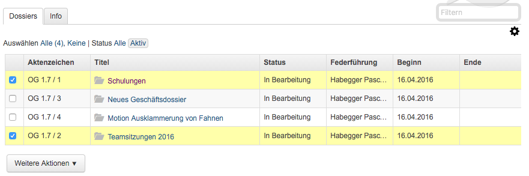
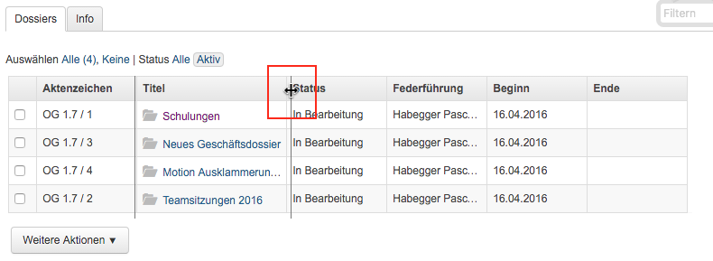
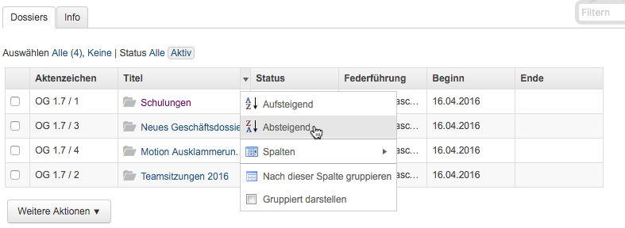
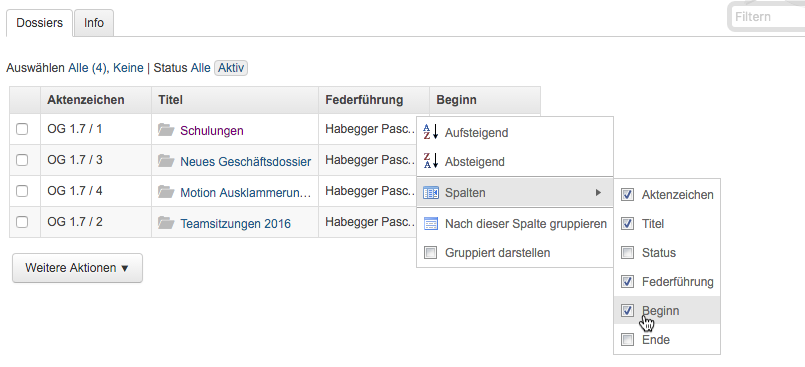
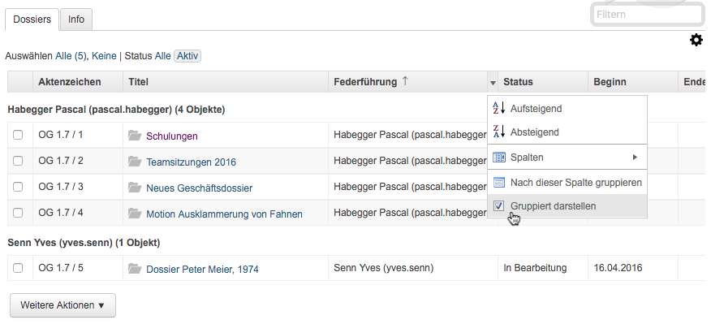
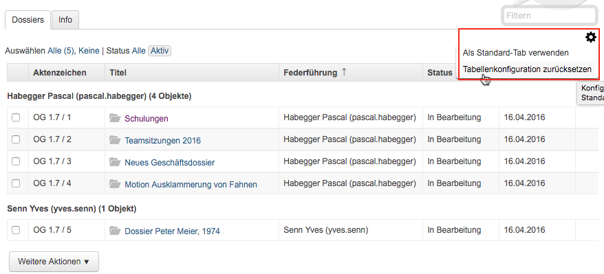
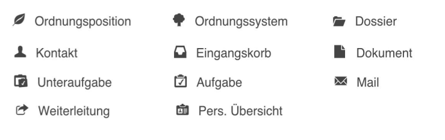
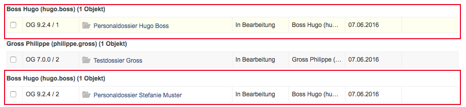

Tipps und Tricks
================

Generelle Tipps und Tricks
--------------------------

Nachfolgend einige generelle Inputs zum Handling:

- Keine Doppelklicks: In OneGov GEVER müssen die Aktionen jeweils nur mit einem
  Mausklick bestätigt werden.

- Mehrere Reiter verwenden: Wir empfehlen, für jedes Dossier einen eigenen
  Reiter im Browser zu verwenden, um das parallele Arbeiten in mehreren Dossiers
  zu erleichtern. Dies sind die Shortcuts dazu:

  - Mac: :kbd:`cmd` + Klick

  - Windows: :kbd:`ctrl` + Klick

- Lesezeichen im Browser (Favoriten) verwenden: Es empfiehlt sich, im Browser
  für häufig benutzte Dossiers und Ordnungspositionen ein Lesezeichen zu setzen,
  damit diese jeweils mit einem Klick wieder geöffnet werden können.

- Schriftgrösse anpassen: Bei Bedarf kann mit folgenden Tastaturkürzeln
  die Schriftgrösse im Webbrowser individuell angepasst werden:

  - Grössere Schrift: :kbd:`ctrl +` (Windows) bzw. :kbd:`cmd +` (Mac)

  - Kleinere Schrift: :kbd:`cmd -` (Windows) bzw. :kbd:`cmd -` (Mac)

- Nachstehend noch eine Übersicht aller in OneGov GEVER verwendeten Icons
  als Übersicht:

|img-grundlagen-14|

Tabellen
--------

Tabellen enthalten Reiter, Spalten und Zeilen, die je nach Anwendung
(Dossier, Aufgaben, etc.) unterschiedliche Inhalte aufnehmen.

|img-grundlagen-1|

Zeilen auswählen
~~~~~~~~~~~~~~~~

Alle Tabellenzeilen können über die Menüpunkte *Auswählen Alle* bzw.
*Auswählen Keine* an- bzw. abgewählt werden.

Einzelne Tabellenzeilen können über das Kästchen links an- und abwählt
werden. Markierte Zeilen erhalten einen gelben Hintergrund und das
Markierungszeichen ☑ in der entsprechenden Zeile.

|img-grundlagen-2|

.. note::
   - Klicken Sie in die Auswahl, um eine Zeile zu markieren.
   - Halten Sie :kbd:`Ctrl` gedrückt und klicken Sie, um eine
     weitere bzw. mehrere nicht zusammenhängende Zeilen zu markieren.
   - Halten Sie :kbd:`Ctrl Shift` gedrückt und klicken Sie, um einen
     zusammenhängenden Bereich zu selektieren.

Spalten
-------

Spaltenbreite beeinflussen
~~~~~~~~~~~~~~~~~~~~~~~~~~

Führen Sie den Cursor in der Spaltenüberschrift an die rechte
Spaltenbegrenzung, bis das entsprechende Zeichen erscheint und bestimmen
Sie die Breite der Spalte mit gedrückter Maustaste.

|img-grundlagen-3|

.. _label-spalten-sortieren:

Spalten sortieren
~~~~~~~~~~~~~~~~~

- Variante 1)

  Führen Sie den Cursor in die Spaltenüberschrift und drücken Sie die
  linke Maustaste. Die Zeilen werden aufsteigend sortiert. Klicken Sie
  nochmals in die Spaltenüberschrift, werden die Zeilen absteigend
  sortiert.

- Variante 2)

  Führen Sie den Cursor in der Spaltenüberschrift an die rechte Begrenzung,
  bis das Auswahlzeichen angezeigt wird und wählen Sie die
  gewünschte Sortierung:

  |img-grundlagen-4|

Spalten ein- und ausblenden
~~~~~~~~~~~~~~~~~~~~~~~~~~~

Spalten können nach Bedarf ein- bzw. ausgeblendet werden. Die
Einstellung kann in jedem Spaltenfeld mit Hilfe des Auswahlzeigers
vorgenommen werden.

|img-grundlagen-5|

Spalten verschieben
~~~~~~~~~~~~~~~~~~~

Die Reihenfolge der Spalten können Sie beeinflussen, indem Sie mit
gedrückter linker Maustaste die Spalte an ihren neuen Ort verschieben.

Beispiel: Die Spalte *Federführung* soll rechts neben der Spalte
*Titel* angezeigt werden.

- Linke Maustaste in Spalte *Federführung* drücken

- Linke Maustaste nach Spalte *Titel* loslassen.

|img-grundlagen-6|

Nach Spalte gruppiert darstellen
~~~~~~~~~~~~~~~~~~~~~~~~~~~~~~~~

Zur besseren Übersichtlichkeit kann der Inhalt für jede Spalte gruppiert
dargestellt werden.

Das nachfolgende Beispiel zeigt das Vorgehen für eine gruppierte
Darstellung der Spalte *Federführend*. Klicken Sie auf das Auswahlfeld
im rechten Rand der Spaltenüberschrift und klicken Sie entweder auf
*Nach dieser Spalte gruppieren* oder *Gruppiert darstellen*.

|img-grundlagen-7|

Die Gruppierung können Sie abschalten, indem Sie entweder die Spalte neu
gruppieren oder im Auswahlfeld einer Spaltenüberschrift die Gruppierung
ausschalten (Klick auf markiertes Feld *Gruppiert
darstellen*.

Wichtig dabei zu beachten ist, dass die Spalte, nach der gruppiert werden soll,
zuerst sortiert wird. Ansonsten erscheint beispielsweise die federführende
Person mehrmals:

Unsortierte und ungruppierte Tabelle:

|img-grundlagen-25|

Sortiert und gruppiert (Der Benutzer Hugo Boss erscheint zusammengefasst):

|img-grundlagen-27|

Einstellungen zurücksetzen
~~~~~~~~~~~~~~~~~~~~~~~~~~

Wählen Sie *Weitere Aktionen → Tabellenkonfiguration
zurückstellen*. Dies kann hilfreich sein, falls eine Tabelle nicht mehr
oder falsch angezeigt wird. Über diesen Menüpunkt werden die
Standardeinstellungen für diese Tabelle geladen.

|img-grundlagen-8|

Anzeige / Ausdruck von Einträgen über mehrere Seiten
----------------------------------------------------

Pro Seite werden standardmässig 50 Einträge angezeigt. Soll mehr
angezeigt werden (z.B. für die Ausgabe in ein PDF), kann die gewünschte
Anzahl Treffer manuell eingetragen werden; maximal können 500 Treffer
pro Seite dargestellt werden.

|img-grundlagen-9|

Emojis bei Aufgaben
-------------------
OneGov GEVER bietet bei den Aufgaben sowie bei Aufgaben-Kommentaren die
Möglichkeit, Emojis einzusetzen, um die Kommunikation etwas persönlicher zu
gestalten. Dazu können die Emojis ganz einfach aus der Menüleiste ins GEVER
reingezogen werden.

|img-grundlagen-40|

.. |img-grundlagen-1| image:: img/media/img-grundlagen-1.png

.. |img-grundlagen-6| image:: img/media/img-grundlagen-6.png

.. |img-grundlagen-9| image:: img/media/img-grundlagen-9.png

.. |img-grundlagen-25| image:: img/media/img-grundlagen-25.png

.. |img-grundlagen-27| image:: img/media/img-grundlagen-27.png
.. |img-grundlagen-40| image:: img/media/img-grundlagen-40.png

.. disqus::
